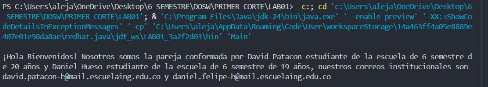
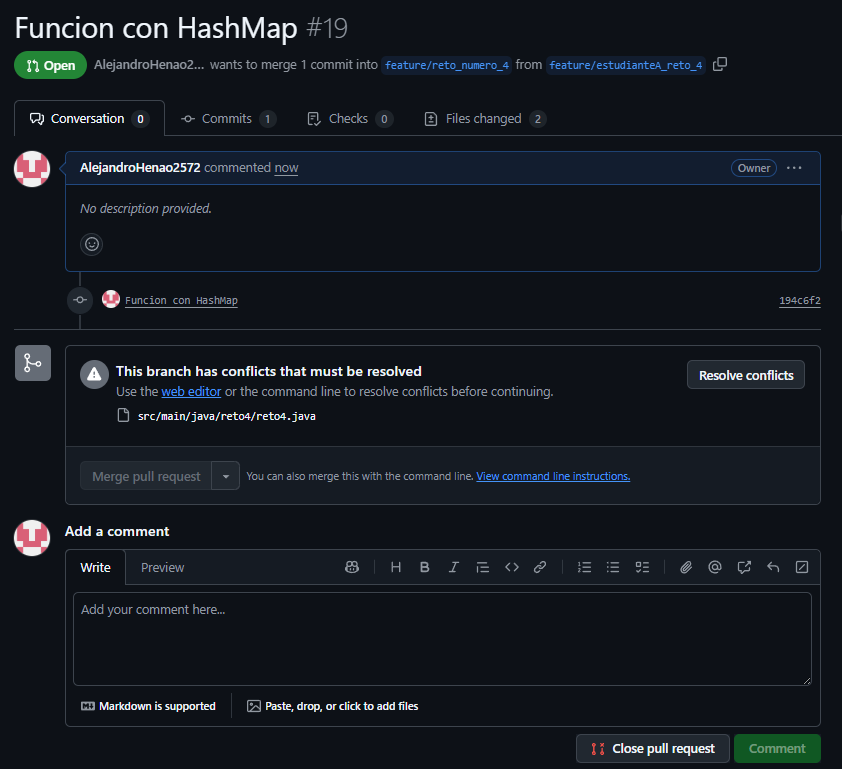
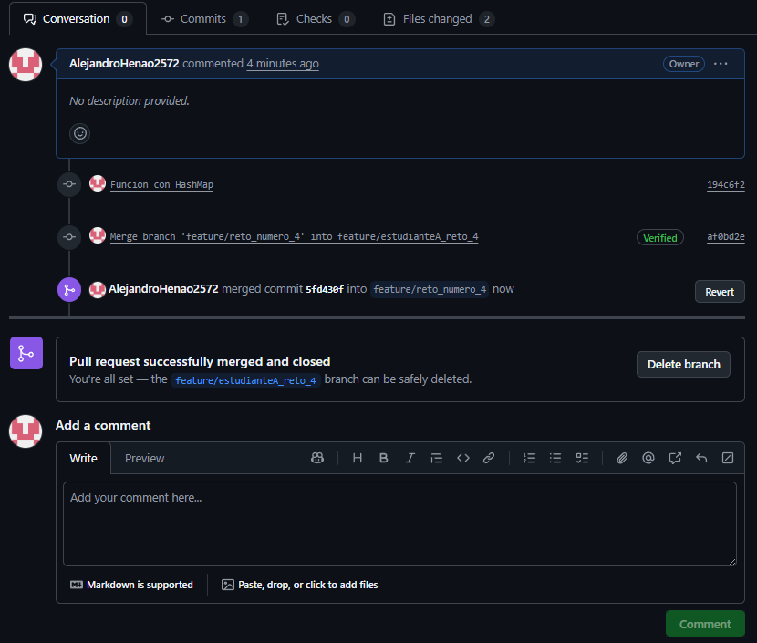
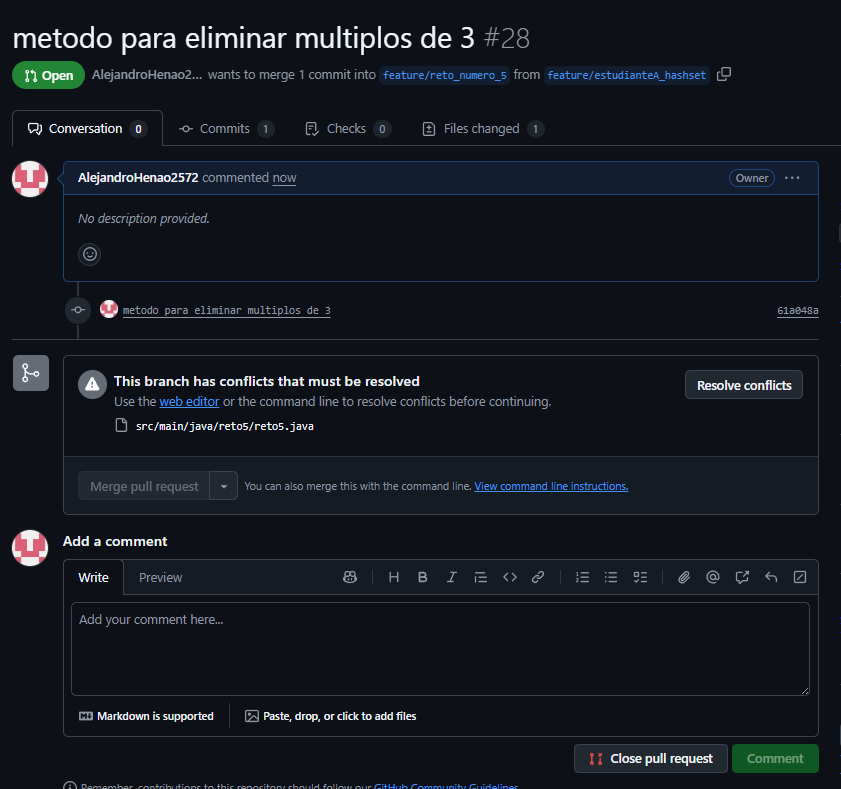

# **LAB01**
Integrantes:  
-David Alejandro Patacon Henao    
-Daniel Felipe Hueso Rueda

## RESPUESTAS  
## PARTE 1
1. Crea un repositorio localmente.  

2. Agrega un archivo de ejemplo al repositorio, el README.md puede ser una gran opción.  

3. Para que sirven los comandos git add y git commit -m “mensaje”?:  

   git add archivo.txt        # Agrega un archivo especifico  
   git add .                  # Agrega TODOS los cambios en la carpeta actual  
   git commit -m "Mensaje descriptivo" # Guardar esos cambios localmente 

5. Crea un repositorio en blanco (vacío) e GitHub.  

6. Configura el repositorio local con el repositorio remoto.
7. Sube los cambios, teniendo en cuenta lo que averiguaste en el punto 3 Utiliza los siguientes comando en el directorio donde tienes tu proyecto, en este orden.
8. Configura el correo en git local de manera correcta

   
9. Vuelve a subir los cambios y observa que todo esté bien en el repositorio remoto

## PARTE 2

1. Se escogen los roles para trabajar en equipo, una persona debe escoger ser "Owner" o Propietario del repositorio y la otra "Collaborator" o Colaborador en el repositorio.  
Integrantes:    
-David Alejandro Patacon Henao  
-Daniel Felipe Hueso Rueda  

3. El owner agrega al colaborador con permisos de escritura en el repositorio que creó en la parte 1  
4. El owner le comparte la url via Teams al colaborador  
5. El colaborador acepta la invitación al repositorio  

6. ¿Que sucedió?  
   Al subir los cambios en el README y hacer push al mismo tiempo, solo se subieron los cambios de uno de los nosotros. Al otro le aparecio un error donde decia que no ese estaba trabajando con la version actual.

7. La persona que perdió la competencia de subir los cambios, tiene que resolver los conflictos, cúando haces pull de los cambios, los archivos tienen los símbolos <<< === y >>> (son normales en la resolución de conflictos), estos conflictos debes resolverlos manualmente.  

8. Volver a repetir un cambio sobre el README.md ambas personas al tiempo para volver a tener conflictos.  
9. Resuelvan el conflicto con IntelliJ si es posible  
   Resolvimos el conflicto con VisualStudioCode  

---
## PARTE 3
1. ¿Hay una mejor forma de trabajar con git para no tener conflictos?
    
   Se pueden seguir las siguientes buenas practicas en git para evitar conflictos y trabajar de una mejor forma:  
   -Actualiza antes de trabajar: git pull origin main.  
   -Trabaja en ramas: git checkout -b feature/nueva-funcion.    
   -Commits pequeños y claros: git commit -m "Mensaje"    
   -Evita editar lo mismo que otros, coordinacion en equipo.    
   -Usa rebase para mantenerse al dia: git fetch origin + git rebase origin/main  
   -Resolver conflictos pronto y no dejar que se acumulen.  
   -Integra con Pull Requests para revisión y control.  
   
2. ¿Qué es y como funciona el Pull Request?
  
   Que es:    
   Es una forma de colaborar en proyectos.  
   Permite que otros revisen el codigo antes de integrarlo. 
   Sirve para discutir, comentar y aprobar cambios.  
   
   Como funciona:  
   Se crea una rama: git checkout -b feature/nueva-funcion  
   Se subem los cambios: git push origin feature/nueva-funcion  
   En GitHub aparece el botón "Compare & pull request"  
   Se Abre el PR se explica que se cambio y por qué  
   El equipo revisa el código, comenta, sugiere mejoras  
   Cuando todos están de acuerdo, se aprueba y se hace merge a la rama correspondiente  
    
3. Creen una rama cada uno y suban sus cambios:

4. Tanto owner como colaborador hacen un cambio en el README.md y hacen un Pull Request (PR) a la rama main/master:  

---

# RETOS

# RETO #1

# RETO #2
  

# RETO #3
  
  
  

# RETO #4
Conflicto generado por funciones de hashtable y hashmap  
  
  

Ejecucion del reto:  
  

Historial de commits:
  

## RETO #5
Conflicto generado por subir funciones con ambas colecciones

Ejecucion:  

Evidencia commits:

## RETO #6

Ejecucion:

Evidencia commits:

---

## PARTE 3 - Cuestionario

1. ¿Cuál es la diferencia entre git merge y git rebase?
Git merge combina el historial de dos ramas en una sola, generando un commit de merge. Git rebase en cambio "reescribe" la historia, aplicando los commits de una rama sobre otra como si se hubieran hecho en secuencia. La diferencia clave es que merge conserva la historia completa mientras que rebase genera un historial más lineal.

2. Si dos ramas modifican la misma línea de un archivo ¿Qué sucede al hacer merge?
Se produce un conflicto. Git no sabe qué cambio conservar, entonces marca esa línea en el archivo para que el desarrollador resuelva manualmente cuál de los cambios (o ambos) deben mantenerse.

5. ¿Para qué sirve git stash y git pop?
git stash guarda temporalmente los cambios que no se han hecho commit, como en una "caja". git pop recupera esos cambios guardados y los aplica de nuevo al área de trabajo.

6. ¿Qué diferencia hay entre HashMap y HashTable?
HashMap permite llaves y valores nulos y no es sincronizado, por lo que es más rápido. HashTable no permite valores nulos y es sincronizado, pero eso lo hace más lento en operaciones concurrentes.

9. ¿Qué hace el método stream().filter() y qué retorna?
filter() recibe un predicado y selecciona solo los elementos que cumplen esa condición. Retorna un nuevo stream con los elementos filtrados.

10. Describe el paso a paso de cómo crear una rama desde develop si es una funcionalidad nueva.
-Posicionarse en develop:
   git checkout develop
-Actualizar develop:
   git pull origin develop
-Crear la nueva rama:
   git checkout -b feature/nueva-funcionalidad

3. ¿Cómo puedes ver gráficamente el historial de merges y ramas en consola?
Con el comando:
git log --graph --oneline --all
Ese comando muestra el historial con ramas y merges de forma visual en la terminal.

5. Explica la diferencia entre un commit y un push.
Un commit guarda los cambios en el repositorio local, mientras que un push envía esos commits al repositorio
remoto (por ejemplo GitHub). Es decir, commit es local y push es remoto.

7. ¿Qué ventajas tiene Collectors.toMap() frente a un bucle tradicional para llenar un mapa?
Usar Collectors.toMap() en streams hace el código más declarativo y legible, además aprovecha el paralelismo de los streams.
Un bucle tradicional funciona, pero es más verboso y menos expresivo.

9. Si usas List con objetos y luego aplicas stream().map() ¿qué tipo de operación estás haciendo?
Estás realizando una transformación. map() toma cada elemento de la lista y lo transforma en otro,
devolviendo un stream con los nuevos valores.

11. ¿Cuál es la diferencia entre crear una rama con git branch y con git checkout -b?
git branch nombre-rama solo crea la rama, pero no te mueve a ella. En cambio, git checkout
-b nombre-rama crea la rama y además cambia automáticamente a esa rama.

13. ¿Por qué es recomendable crear ramas feature/ para nuevas funcionalidades en lugar de trabajar en main directamente?
Porque así se mantiene el main estable y sin errores, mientras que las nuevas funcionalidades se desarrollan y prueban de forma aislada.
Esto facilita la colaboración, evita romper el proyecto principal y mantiene un flujo de trabajo más organizado.

